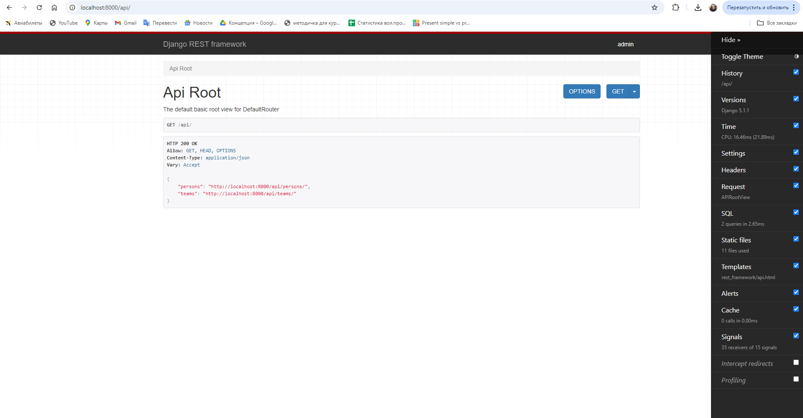
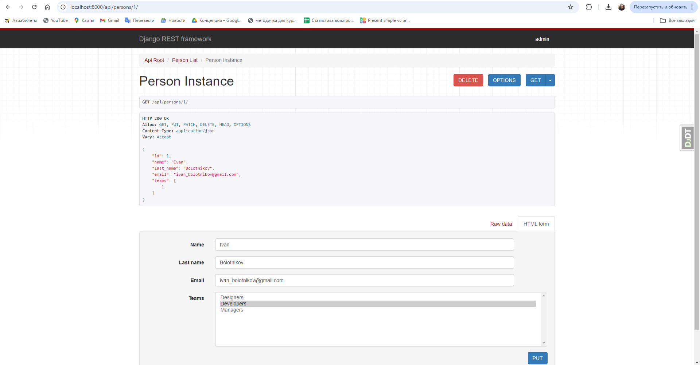
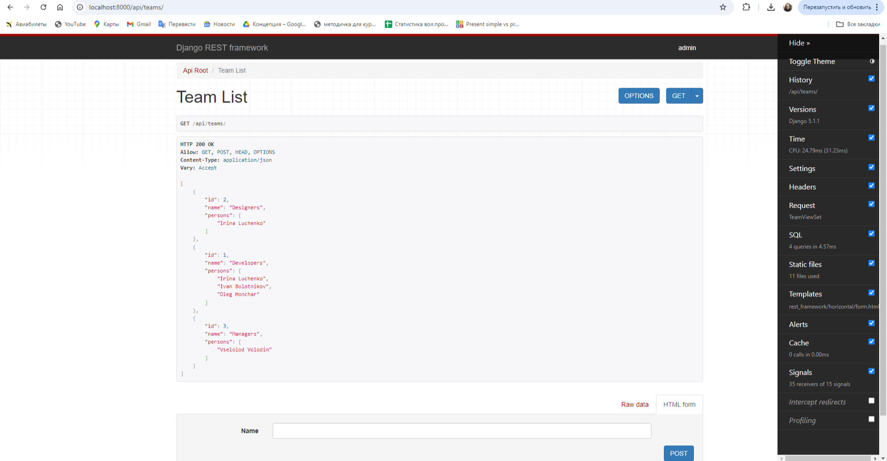
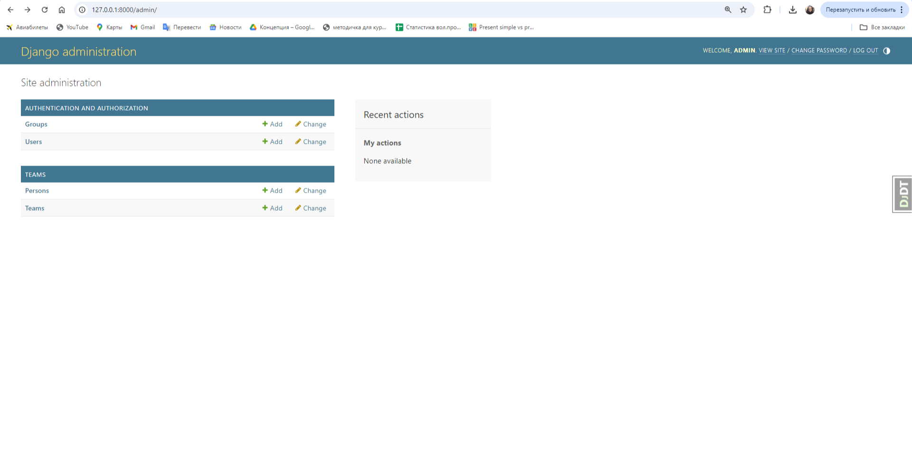
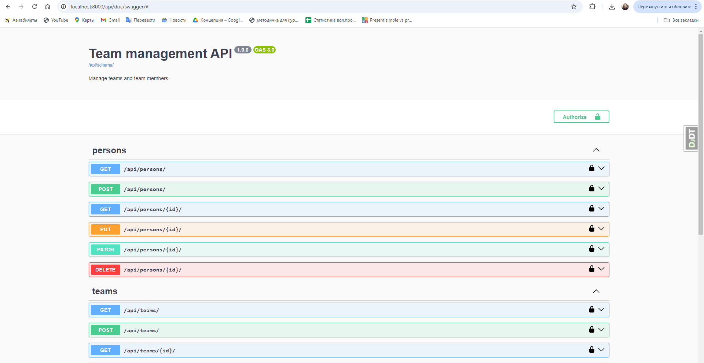

# Team Management REST API

This project implements a REST API for managing teams and their members using Django and Django Rest Framework.  
The API allows users to create, read, update, and delete (CRUD) teams and people within those teams.

## Features

- **CRUD operations** for both `Team` and `Person` models.
- **Filtering** of teams by name.
- **Admin panel** for managing the application.
- **Documentation** using drf-spectacular.
- **Docker** and **Docker Compose** support for easy setup and deployment.
- Connection to a **PostgreSQL** database.
- Django Debug Toolbar.

## Models

### Team

- `name`: A string representing the name of the team.

### Person

- `name`: The first name of the person.
- `last_name`: The last name of the person.
- `email`: The unique email address of the person.
- `teams`: A many-to-many relationship with the `Team` model.

**Note:** The `ManyToManyField` in the `Person` model allows a person to belong to multiple teams, 
reflecting real-world scenarios where an individual, such as a manager, can participate in 
both administration and development teams.

## Setup  

1. Create a `.env` file in the root directory of the project and add your environment variables.  
   Use `.env.template` as an example.  

2. Ensure Docker Compose configuration:  
   Your `docker-compose.yml` should be configured to connect to the PostgreSQL database.  
   Verify that your `docker-compose.yml` file includes the necessary configurations.  


## Installing

```bash
git clone https://github.com/Irina17191/team-management/tree/main  
cd team_management    
python -m venv venv  
source venv/bin/activate  # On Windows use `venv\Scripts\activate`  
pip install -r requirements.txt  
Set environment variables in the .env file.
```

## Run with docker  

```bash
1. This command will build the Docker images and start the containers for the Django application and PostgreSQL database:  
docker compose build  
2. Up Docker containers:  
docker compose up  
3. Create superuser:  
docker exec -it <container_id> /bin/sh  
python manage.py createsuperuser  
```

You can use the following credentials:  
(already created superuser)  
  
Username: admin  
Email: alex.shevelo@gmail.com  
Password: 12345  


## Run locally  

```bash  
python manage.py migrate  
python manage.py runserver  
```

## Access the API

The API will be available at:
- `http://localhost:8000/api/`
- `http://127.0.0.1:8000/api/`

The admin panel can be accessed at:
- `http://localhost:8000/admin/`
- `http://127.0.0.1:8000/admin/`


## API Endpoints

### Teams

- `GET /api/teams/`: List all teams (with optional filtering by name).
- `POST /api/teams/`: Create a new team.
- `GET /api/teams/{id}/`: Retrieve a specific team.
- `PATCH /api/teams/{id}/`: Update a specific team.
- `DELETE /api/teams/{id}/`: Delete a specific team.

### Persons

- `GET /api/persons/`: List all persons.
- `POST /api/persons/`: Create a new person.
- `GET /api/persons/{id}/`: Retrieve a specific person.
- `PATCH /api/persons/{id}/`: Update a specific person.
- `DELETE /api/persons/{id}/`: Delete a specific person.


## API Documentation

These endpoints provide interactive documentation and schema definitions for the API:
- **OpenAPI Schema:**  
  `GET /api/schema/`

- **Swagger UI:**  
  `GET /api/doc/swagger/`

- **ReDoc:**  
  `GET /api/doc/redoc/`


## Environment Variables

The project uses environment variables to manage deployment and operation. The `.env.template` file contains the necessary variables. You will need to create a `.env` file in the project root and provide the following:

```env
POSTGRES_PASSWORD=your_password
POSTGRES_USER=your_user
POSTGRES_DB=your_db
POSTGRES_HOST=your_host
POSTGRES_PORT=5432
PGDATA=/var/lib/postgresql/data
SECRET_KEY=<your_secret_key>
```


## Testing

To run the tests, use the following command:

```bash
docker-compose exec django_app python manage.py test
```

For any questions or feedback, please reach out to me at iryna.honcharenko.python@gmail.com.  

Here are screenshots of the application:  
  

  



  


